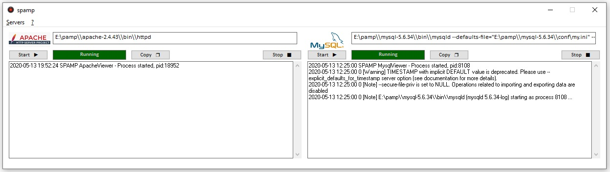

# pamp

**`pamp`** is a ready-to-use Web Service Stack for Windows (at the moment...), containing the **Apache HTTP Server**, the **MySQL relational database** management system, and the **PHP programming language**.

It provides Apache, MySQL and PHP stacks in a single solution.
**`pamp`** is able to launch, stop and control Apache and MySQL processes. Apache is already configured to run the PHP runtime.
Both Apache and MySQL come with the basic configuration.


[](https://github.com/malkev/pamp/blob/master/LICENSE)
[](https://github.com/malkev/pamp/releases/)



## Versions
Last release packages:
```
Apache: 2.4.43
MySQL: 5.6.34
PHP: 7.4.4 (ts)
OpenSSL: 1.0.2q
```


## Installation
**`pamp`** is a portable package, so it doesn't need to be installed. The only thing you need to do is copy the folder to your file system. 
In this repository you will find both the 32 and 64 bit versions.

### Pre-requisites
**`pamp`** uses windows api, so it has as its only requirement the c ++ runtime library 2017, which should already be present in the operating system. If they are not, you can download the installation package from this repository, both for x86 and for x64 systems.

## Configuration
**`pamp`** is already configured. It uses a configuration file called `pamp.conf.xml` which is already set for current versions.
However, you can change the settings if you want to perform an update of Apache HTTP Server or MySQL. For this type of need, you can consult the appropriate section.

## Apache configuration
The main Apache configuration file, `httpd.conf`, is located in the `apache-x.y.z\conf` folder, where `x.y.z` is the version of Apache used. 
It is the standard configuration file, except for the final part of the file where the following lines have been added:

1) This is for your custom configuration file:

```
### MYAPACHE
# Include here your own supplementary config file
# Include x:\\myApache.conf
```

2) This is for attach the PHP runtime configuration file:
```
### PHP
# Change loadPHP.conf for customize PHP 
Include ${pamp_basedir}\\loadPHP.conf
```

## MySQL configuration
The main MySQL configuration file, `my.ini`, is located in the `mysql-x.y.z\conf` folder, where `x.y.z` is the version of MySQL used.
It is the standard configuration file. The database is located on `db` folder of the main `spamp` directory.

## PHP configuration
The main PHP configuration file, `php.ini`, is located in the `php-x.y.z\conf` folder, where `x.y.z` is the version of PHP used.
It is the standard configuration file, except for:
- the error log file location (`error_log`), set to `php-x.y.z\_log\php_error.log`
- the session folder location (`session.save_path`), set to `php-x.y.z\_sessions`
- the extensions folder location (`extension_dir`), set to `php-x.y.z\ext`

### SSH/SSL
Related modules are loaded by `loadPHP.conf`.
OpenSSL libraries are located to `openssl-x.y.z`, where `x.y.z` is the version of OpenSSL used.
SSH libraries are located to `php_ssh2`.

## Logs 
The `_log` folder is the target location for:

* apache_access.log
* apache_error.log
* php_error.log
* mysql_error_log.err
